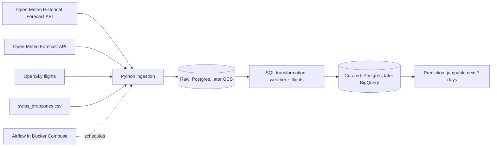

# Architecture v0.1

## Ingestion strategy
- **Weather backfill:** one-off load of Jan 2026 to today via Historical Forecast API. Afterwards a daily incremental load via `past_days`.
- **Forecast:** daily full refresh of the next 7 days.
- **Flights:** backfill in 2-day windows (API limit) per airfield, afterwards a daily incremental load.
- **Failure behaviour:** retries with backoff; reruns and backfills are safe because loads are idempotent.
