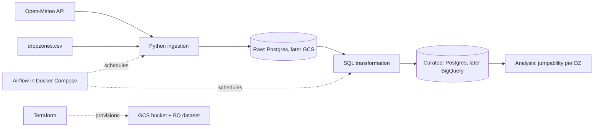

# Architecture v0.1

## Ingestion strategy
- **Backfill:** one-off load from 2022 to today, then **incremental** daily load of the last day(s).
- **Granularity:** one API call per dropzone and date range.
- **Idempotent:** upsert on (dz_id, timestamp), so reruns are safe.
- **Failures:** Airflow retries with backoff; one failed dropzone does not block the others.
- **Cloud (final):** write raw JSON straight to GCS, without a local intermediate step.
