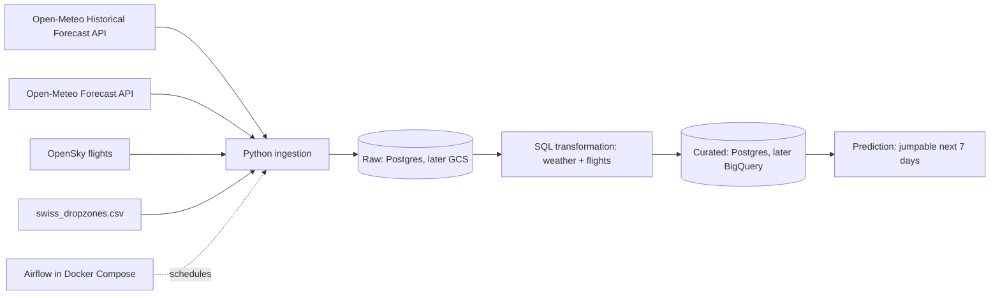

# Architecture v0.1

## Ingestion strategy
- **Backfill:** one-off load from the start of 2026 to today, then **incremental** daily load of the last day(s). Forecast is a daily full refresh of the next 7 days.
- **Idempotent!**
