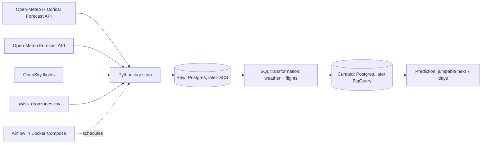

# Architecture v0.1

## Ingestion strategy
- **Weather backfill:** one-off load of Jan 2026 to today via Historical Forecast API. Afterwards a daily incremental load via `past_days`.
- **Forecast:** daily full refresh of the next 7 days.
- **Flights:** backfill in 2-day windows (API limit) per airfield, afterwards a daily incremental load.
- **Failure behaviour:** retries with backoff; reruns and backfills are safe because loads are idempotent.

## Division of responsibilities
Each of us owns one **data source end to end** (ingestion → raw → staging) and one **platform part**. The join of weather and flights, the prediction and the docs are shared. Every pull request is reviewed by the other person, so both of us can explain the whole pipeline in the defences.

| Area | Nico Clerici | Jan Walker |
|---|---|---|
| Data source | Flights (OpenSky): ingestion, rate limits, identifying jump aircraft, hourly "jump happened" label | Weather (Open-Meteo): historical + forecast ingestion, variable choice, time-zone handling |
| Platform, midterm | PostgreSQL schema, Docker Compose | Airflow DAGs: schedule, retries, backfill |
| Platform, final | Terraform (GCS bucket, BigQuery dataset) | Cloud ingestion path to GCS, data-quality checks |
| Shared | Join weather + flights, data model (grain, partitioning), prediction, README / verification steps, Architecture v0.2 and final | ← same |
